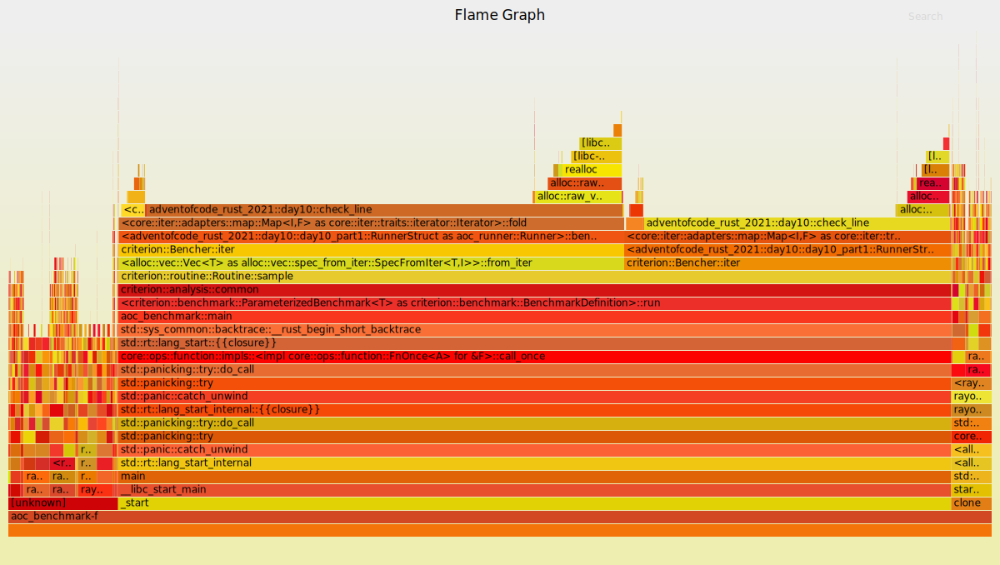

# Execution times for Advent of Code 2021
- 🎅 Solutions by [Artur Hallmann](https://github.com/arturh85)
- 🔖 [Github Repository](https://github.com/arturh85/adventofcode-rust-2021)
- 🚀 Benchmarked using [Github Actions](https://github.com/features/actions)
## Distribution of 637.91 ms
![Pie Chart](https://quickchart.io/chart?c=%7B%22type%22%3A%22outlabeledPie%22%2C%22data%22%3A%7B%22labels%22%3A%5B%22Day%201.1%22%2C%22Day%201.2%22%2C%22Day%202.1%22%2C%22Day%202.2%22%2C%22Day%203.1%22%2C%22Day%203.2%22%2C%22Day%204.1%22%2C%22Day%204.2%22%2C%22Day%205.1%22%2C%22Day%205.2%22%2C%22Day%206.1%22%2C%22Day%206.2%22%2C%22Day%207.1%22%2C%22Day%207.2%22%2C%22Day%208.1%22%2C%22Day%208.2%22%2C%22Day%209.1%22%2C%22Day%209.2%22%2C%22Day%2010.1%22%2C%22Day%2010.2%22%2C%22Day%2011.1%22%2C%22Day%2011.2%22%2C%22Day%2012.1%22%2C%22Day%2013.1%22%2C%22Day%2013.2%22%2C%22Day%2014.1%22%2C%22Day%2014.2%22%2C%22Day%2015.1%22%2C%22Day%2015.2%22%5D%2C%22datasets%22%3A%5B%7B%22backgroundColor%22%3A%5B%22%23c42cb2%22%2C%22%23065535%22%2C%22%23000000%22%2C%22%23133337%22%2C%22%239d1e32%22%2C%22%23008080%22%2C%22%23ff0000%22%2C%22%23ffa500%22%2C%22%23ff7373%22%2C%22%2340e0d0%22%2C%22%230000ff%22%2C%22%23b0e0e6%22%2C%22%23d3ffce%22%2C%22%23666666%22%2C%22%23bada55%22%2C%22%23003366%22%2C%22%23fa8072%22%2C%22%23ffb6c1%22%2C%22%239b9a9a%22%2C%22%23800000%22%2C%22%23800080%22%2C%22%23c39797%22%2C%22%23f08080%22%2C%22%2300ff00%22%2C%22%23cccccc%22%2C%22%2320b2aa%22%2C%22%23333333%22%2C%22%23ffc3a0%22%2C%22%2366cdaa%22%5D%2C%22data%22%3A%5B54%2C69%2C139%2C139%2C342%2C111%2C312%2C410%2C2096%2C2637%2C8%2C8%2C282%2C578%2C891%2C1325%2C630%2C2867%2C107%2C123%2C790%2C1767%2C369896%2C5456%2C4888%2C10619%2C726%2C7210%2C223435%5D%7D%5D%7D%2C%22options%22%3A%7B%22plugins%22%3A%7B%22legend%22%3Afalse%2C%22outlabels%22%3A%7B%22text%22%3A%22%25l%20%25p%22%2C%22color%22%3A%22white%22%2C%22stretch%22%3A35%2C%22font%22%3A%7B%22resizable%22%3Atrue%2C%22minSize%22%3A12%2C%22maxSize%22%3A18%7D%7D%7D%7D%7D)
# 📅 [Day 1: Sonar Sweep](https://adventofcode.com/2021/day/1)
- [Solution Source](https://github.com/arturh85/adventofcode-rust-2021/blob/master/src/day1.rs)
## Day 1 Part 1
### Result : 1292
	
- generator: 51.401µs 
	
- runner: 1.5µs

### [Flame Graph](flamegraph-day1-1.svg):

## Day 1 Part 2
### Result : 1262
	
- generator: 53.201µs 
	
- runner: 14.2µs

### [Flame Graph](flamegraph-day1-2.svg):

# 📅 [Day 2: Dive!](https://adventofcode.com/2021/day/2)
- [Solution Source](https://github.com/arturh85/adventofcode-rust-2021/blob/master/src/day2.rs)
## Day 2 Part 1
### Result : 1882980
	
- generator: 131.903µs 
	
- runner: 7µs

### [Flame Graph](flamegraph-day2-1.svg):

## Day 2 Part 2
### Result : 1971232560
	
- generator: 131.503µs 
	
- runner: 6.6µs

### [Flame Graph](flamegraph-day2-2.svg):

# 📅 [Day 3: Binary Diagnostic](https://adventofcode.com/2021/day/3)
- [Solution Source](https://github.com/arturh85/adventofcode-rust-2021/blob/master/src/day3.rs)
## Day 3 Part 1
### Result : 3148794
	
- generator: 46.701µs 
	
- runner: 294.405µs

### [Flame Graph](flamegraph-day3-1.svg):

## Day 3 Part 2
### Result : 2795310
	
- generator: 43.701µs 
	
- runner: 66.402µs

### [Flame Graph](flamegraph-day3-2.svg):

# 📅 [Day 4: Giant Squid](https://adventofcode.com/2021/day/4)
- [Solution Source](https://github.com/arturh85/adventofcode-rust-2021/blob/master/src/day4.rs)
## Day 4 Part 1
### Result : 41503
	
- generator: 216.705µs 
	
- runner: 94.802µs

### [Flame Graph](flamegraph-day4-1.svg):

## Day 4 Part 2
### Result : 3178
	
- generator: 174.704µs 
	
- runner: 234.905µs

### [Flame Graph](flamegraph-day4-2.svg):

# 📅 [Day 5: Hydrothermal Venture](https://adventofcode.com/2021/day/5)
- [Solution Source](https://github.com/arturh85/adventofcode-rust-2021/blob/master/src/day5.rs)
## Day 5 Part 1
### Result : 7297
	
- generator: 240.504µs 
	
- runner: 1.854532ms

### [Flame Graph](flamegraph-day5-1.svg):

## Day 5 Part 2
### Result : 21038
	
- generator: 242.605µs 
	
- runner: 2.393254ms

### [Flame Graph](flamegraph-day5-2.svg):

# 📅 [Day 6: Lanternfish](https://adventofcode.com/2021/day/6)
- [Solution Source](https://github.com/arturh85/adventofcode-rust-2021/blob/master/src/day6.rs)
## Day 6 Part 1
### Result : 352195
	
- generator: 6.1µs 
	
- runner: 400ns

### [Flame Graph](flamegraph-day6-1.svg):

## Day 6 Part 2
### Result : 1600306001288
	
- generator: 6.901µs 
	
- runner: 600ns

### [Flame Graph](flamegraph-day6-2.svg):

# 📅 [Day 7: The Treachery of Whales](https://adventofcode.com/2021/day/7)
- [Solution Source](https://github.com/arturh85/adventofcode-rust-2021/blob/master/src/day7.rs)
## Day 7 Part 1
### Result : 349812
	
- generator: 34.101µs 
	
- runner: 246.405µs

### [Flame Graph](flamegraph-day7-1.svg):

## Day 7 Part 2
### Result : 99763899
	
- generator: 33.601µs 
	
- runner: 543.811µs

### [Flame Graph](flamegraph-day7-2.svg):

# 📅 [Day 8: Seven Segment Search](https://adventofcode.com/2021/day/8)
- [Solution Source](https://github.com/arturh85/adventofcode-rust-2021/blob/master/src/day8.rs)
## Day 8 Part 1
### Result : 495
	
- generator: 884.518µs 
	
- runner: 5.3µs

### [Flame Graph](flamegraph-day8-1.svg):

## Day 8 Part 2
### Result : 1055164
	
- generator: 894.718µs 
	
- runner: 429.609µs

### [Flame Graph](flamegraph-day8-2.svg):

# 📅 [Day 9: Smoke Basin](https://adventofcode.com/2021/day/9)
- [Solution Source](https://github.com/arturh85/adventofcode-rust-2021/blob/master/src/day9.rs)
## Day 9 Part 1
### Result : 478
	
- generator: 227.905µs 
	
- runner: 401.308µs

### [Flame Graph](flamegraph-day9-1.svg):

## Day 9 Part 2
### Result : 1327014
	
- generator: 212.204µs 
	
- runner: 2.653362ms

### [Flame Graph](flamegraph-day9-2.svg):

# 📅 [Day 10: Syntax Scoring](https://adventofcode.com/2021/day/10)
- [Solution Source](https://github.com/arturh85/adventofcode-rust-2021/blob/master/src/day10.rs)
## Day 10 Part 1
### Result : 392367
	
- generator: 300ns 
	
- runner: 105.302µs

### [Flame Graph](flamegraph-day10-1.svg):

## Day 10 Part 2
### Result : 2192104158
	
- generator: 300ns 
	
- runner: 121.603µs

### [Flame Graph](flamegraph-day10-2.svg):

# 📅 [Day 11: Dumbo Octopus](https://adventofcode.com/2021/day/11)
- [Solution Source](https://github.com/arturh85/adventofcode-rust-2021/blob/master/src/day11.rs)
## Day 11 Part 1
### Result : 1755
	
- generator: 6.7µs 
	
- runner: 782.016µs

### [Flame Graph](flamegraph-day11-1.svg):

## Day 11 Part 2
### Result : 212
	
- generator: 5.4µs 
	
- runner: 1.760936ms

### [Flame Graph](flamegraph-day11-2.svg):

# 📅 [Day 12: Passage Pathing](https://adventofcode.com/2021/day/12)
- [Solution Source](https://github.com/arturh85/adventofcode-rust-2021/blob/master/src/day12.rs)
## Day 12 Part 1
### Result : 3463
	
- generator: 27.3µs 
	
- runner: 369.8679ms

- 🤯 Flame Graph generation took longer than three minutes.
//! [Day 13: Transparent Origami](https://adventofcode.com/2021/day/13)
- [Solution Source](https://github.com/arturh85/adventofcode-rust-2021/blob/master/src/day13.rs)
## Day 13 Part 1
### Result : 847
	
- generator: 1.151423ms 
	
- runner: 4.303287ms

### [Flame Graph](flamegraph-day13-1.svg):

## Day 13 Part 2
###...##..####.###...##..####..##..###..
#..#.#..#....#.#..#.#..#.#....#..#.#..#.
###..#......#..#..#.#....###..#..#.###..
#..#.#.....#...###..#....#....####.#..#.
#..#.#..#.#....#.#..#..#.#....#..#.#..#.
###...##..####.#..#..##..####.#..#.###..
### Result : BCZRCEAB
	
- generator: 1.122422ms 
	
- runner: 3.764077ms

### [Flame Graph](flamegraph-day13-2.svg):

//! [Day 14: Extended Polymerization](https://adventofcode.com/2021/day/14)
- [Solution Source](https://github.com/arturh85/adventofcode-rust-2021/blob/master/src/day14.rs)
## Day 14 Part 1
### Result : 2233
	
- generator: 23.201µs 
	
- runner: 10.594736ms

### [Flame Graph](flamegraph-day14-1.svg):

## Day 14 Part 2
### Result : 2884513602164
	
- generator: 24.4µs 
	
- runner: 700.414µs

### [Flame Graph](flamegraph-day14-2.svg):

//! [Day 15: Chiton]()
- [Solution Source](https://github.com/arturh85/adventofcode-rust-2021/blob/master/src/day15.rs)
## Day 15 Part 1
### Result : 363
	
- generator: 269.006µs 
	
- runner: 6.93944ms

### [Flame Graph](flamegraph-day15-1.svg):

## Day 15 Part 2
### Result : 2835
	
- generator: 270.506µs 
	
- runner: 223.163509ms

- 🤯 Flame Graph generation took longer than three minutes.
